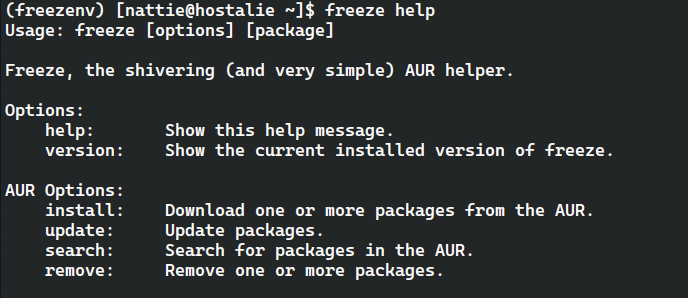
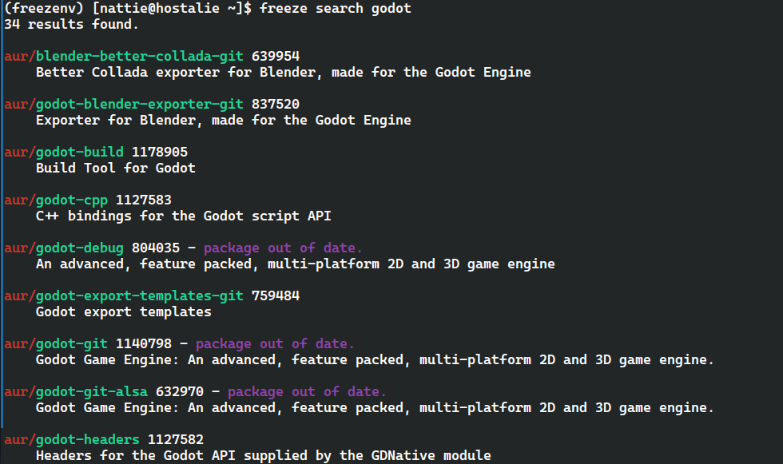

### freeze

freeze, the shivering (and likely broken) AUR helper.

# Before you install
This is in early beta. Install and update functions do not work yet. I am trying my best to make them work.


# Screenshots





# Installation

```bash
git clone https://github.com/omoNattie/freeze

cd freeze

pyinstaller freeze.py

cd dist/freeze/

./freeze help
```

## Moving to path

For fish shell users.
```bash
# ~/.config/fish/config.fish

fish_add_path -m ~/path/to/freeze/dist/freeze 
```

for bash users
```bash
# ./bashrc

EXPORT PATH=$PATH:$HOME/path/to/freeze/dist/freeze
```